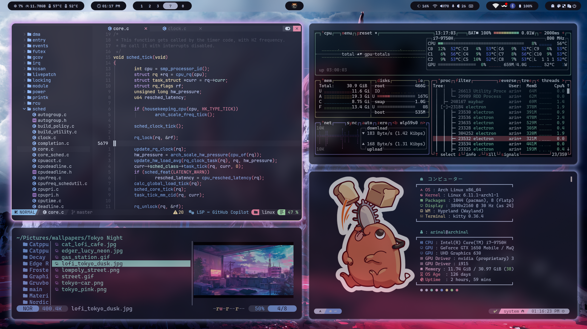

# Hyprdotfiles

Meticulously crafted dotfiles for a POSIX-compliant environment. Powered by Hyprdots,
this configuration replicates the features showcased in this [demo](https://youtu.be/2rWqdKU1vu8?si=b0Pw6bx9NWxdVu8B).

## Screenshots



## Features

* **Window Manager:** [Hyprland](https://hyprland.org/), powered by prasanthrangan's [Hyprdots](https://github.com/prasanthrangan/hyprdots) for a truly captivating desktop experience.
* **Text Editor:** [Neovim](https://neovim.io/) / [Neovide](https://github.com/neovide/neovide) 🎨, elevated by [NChad](https://nvchad.com/) 🚀 for a **visually stunning**, feature-rich, and streamlined experience.
* **Shell:** [Zsh](https://www.zsh.org/), providing a powerful and customizable command-line interface. Supercharged by [Zinit](https://github.com/zdharma-continuum/zinit) for effortless plugin management.
* **PDF Viewer:** [Zathura](https://pwmt.org/projects/zathura/), a lightweight and keyboard-driven PDF viewer.
* **Alternative Window Manager:** [i3](https://i3wm.org/), a reliable fallback for Xorg-based sessions when needed.

## Installation

1. **Clone the repository:** into any folder of your choice. Note that it doesn't need to be inside `~/.config`.
   ```bash
   git clone git@github.com:arinal/dotfiles.git
   ```
2. To use the non Hyprland configurations, create symbolic links to the corresponding folders within your `~/.config` directory. For example:
   ```bash
   ln -s /path/to/dotfiles/nvim    ~/.config/nvim
   ln -s /path/to/dotfiles/zathura ~/.config/zathura
   ln -s /path/to/dotfiles/zsh     ~/.config/zsh
   ln -s /path/to/dotfiles/i3      ~/.config/i3
   ```
3. For Hyprland setup:
   - Install [Hyprdots](https://github.com/prasanthrangan/hyprdots) by following the instructions in its repository.
     This will also install Hyprland. Ideally, this is executed right after a fresh ArchLinux installation.
   - You can find inspiration and customize it to your liking from this repository. 
